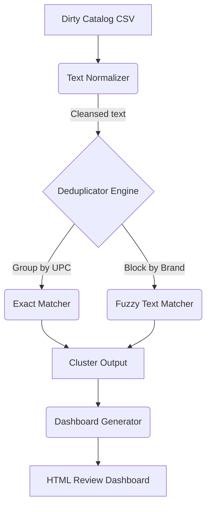

# 🔍 product-deduplicator

[](https://github.com/veronikay1309/application-engineer-portfolio/actions/workflows/ci.yml)
[](https://www.python.org/downloads/)

> An automated catalog cleansing engine that uses exact mapping and Fuzzy string matching (Levenshtein distance) to identify and cluster duplicate products.

---

## 🎯 Problem Statement

E-commerce catalogs inevitably accumulate duplicate product listings due to multiple vendor feeds, manual data entry errors, and varying naming conventions. This fragmentation ruins the customer search experience and artificially inflates inventory counts. Application Engineers tasked with "data quality validation" need automated ways to clean this data.

**`product-deduplicator`** solves this by:
1. Normalizing noisy text (lowercasing, punctuation removal, expanding abbreviations like `blk` -> `black`).
2. Finding "Exact Matches" via structured identifiers (UPC/ASIN).
3. Finding "Fuzzy Matches" by blocking items by brand and calculating text similarity using `thefuzz` (Levenshtein Distance).
4. Emitting suspected clusters to an HTML dashboard for human review.

---

## 🏗️ Architecture



---

## ✨ Features

- **Text Normalization:** Standardizes common e-commerce abbreviations (`oz`, `blk`, `pkg`) using Regex.
- **O(N^2) Optimization via Blocking:** Fuzzy matching every item against every other item is prohibitively expensive. This tool groups (blocks) items by `brand` or `category` first, only applying Levenshtein math to smaller sub-groups.
- **`token_sort_ratio`:** Uses advanced fuzzy logic that handles out-of-order words (e.g., "Apple iPhone 14" matches "iPhone 14 Apple").
- **Reviewer Dashboard:** Generates a visually clean HTML UI for data stewards to review the AI's merging decisions.

---

## 🚀 Quick Start

```bash
# 1. Install dependencies
make install

# 2. Generate simulated dirty catalog (with injected duplicates)
make generate-data

# 3. Run the deduplication engine
make run
```

### Sample Output

```text
1. Loading Catalog...
2. Normalizing Text...
3. Finding Duplicates...
Running Exact Matcher on 'upc'...
Found 1 exact match clusters.
Running Fuzzy Matcher on 'product_name_clean', blocking by 'brand'...
Found 3 fuzzy match clusters.
4. Generating Reports...
Saved HTML dashboard to output/deduplication_dashboard.html
✅ Deduplication complete. Found 4 suspected duplicate clusters.
```

**Open `output/deduplication_dashboard.html` in your browser to view the suspected merges!**

---

## 🧪 Testing

Includes unit tests for regex normalization and fuzzy logic matching:

```bash
make test
```

## 📄 License
MIT
